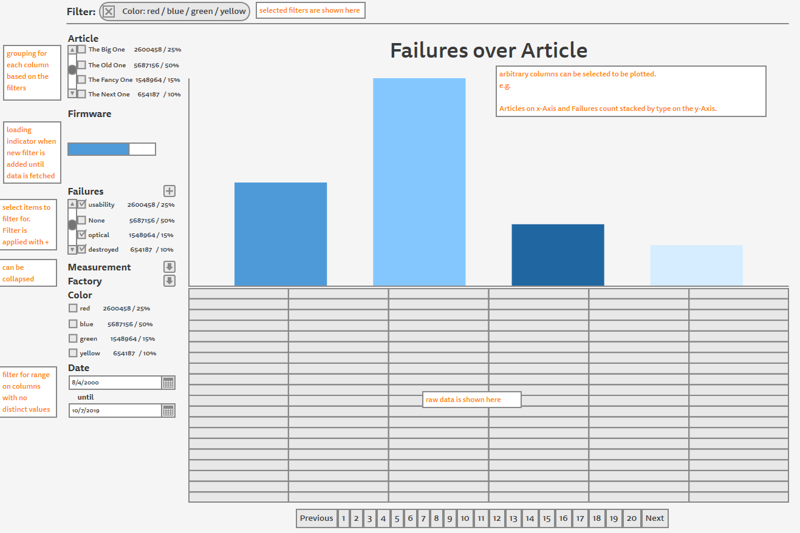

# dexter
flexible data exploration for mid-size data sets

## Current State
Is this an actual existing tool? Not really!

It only exists in my head and I am planning to work on it as a side project.
I already did some benchmarks and it looks feasibly.

I [evaluated several other tools](#comparision) but none of them fitted my
needs.

Here I want do introduce my ideas to see if there are others
which are interested in such a tool.

If you like the idea please give me a star
or watch this project to indicate me that there is some interest.

If you have suggestions for improvement, similar use cases
or you know a already existing tool which does the same write an issue.

## Overview
Interactive data analysis and exploration for log data not only over time.

* up to 10 million documents on standard hardware (MacBook Pro Late 2012)
  * maybe 100 million possible and still fast enough for interactive exploration
* narrow down shown data by values in arbitrary fields
* create graphs for arbitrary fields
* direct access to raw data
* no adaptation needed when data schema changes
* stores documents with variable fields
  of various types (numbers, strings, bool, dates)

## UI Prototype

The proposed UI is divided in four sections
### Selection Bar
Here you can see all fields available in one or more of our documents.

For each field you can select a variation of distinct items (or range)
as a [global filter](#filter-bar).
For each item in a field you can also see,
how often it occures in the filtered dataset
(in absolute as well as relative numbers).

For each field only the items of documents,
where the global filter applies, are shown.
After applying a filter the [selection bar](#selection-bar)
is updated immideately.

### Filter Bar
Here you see all currently active filters.
You can also delete a active filter from here.

### Graph
You have one Graph which can be easily customized to fit your needs.

You can customize the following parts:
* Chart type (bar, line, pie)
* Field on the x axis
* Field to aggregate on the y-axis
* And how to aggregate (count, sum, avg)
* If your field on the y-axis is not continious
  you can also stack it by its distinct values

### Data Section
Here you can see your raw data.

## Use Case
Assume you have a dataset with your production log. Each document correlates to
a device you have produces. It contains things like:
* Serial number
* Article number
* Software version or factory settings
* various measurements
* potential failure
* delivery number
* etc.

Now you want to explorer your data to find out for example:
* All the delivery numbers containing devices with a buggy software version.
* How a measurement has changed over different revisions of an article
* If there is an accumulation of failures somewhere to decrease failure rate

Lets play through the last example.

First you setup the graph as a stacked bar chart.
Article numbers on the x axis
and a stacked bar with the different types of failures.
Now you already see if some failure type occures more often
on a certain article number.
So lets filter by this article number and this failure type.
You now see immedeately for each field only the distinct entries of documents
where the selected filter is true.
For example you see that in your field for the software version is only one
version left.

With a few simple steps you where able to find out where you have a spike in
failure rates in your production. As well as narrow it down to the root cause of
this spike in failure rates.

## Comparision
### BI-Tools
There are a lot of Business Intelligence Tools (Qlik, Tableu, PowerBI, ...)
out there which on a first glance look perfect for this task.

But for my purposes they are to unflexible.
When you create a Dashboard you have to create a own widget for each field you
want to filter for.
I want a dashboard where I see all possible fields and can explore the data from
there on.
And you do not have a possibility to drill down to the actual raw documents.

### Log Analyzer
There are also some log analysis frameworks (like ElasticSearch Kibana)
out there which also come very close but also miss some key aspects.

Visualization is mostly only over time and cannot be customized to be over
other fields. They are in general very time centric
whereas for me time is just one of several fields.
While you can often filter for all possible fields in your documents. It is
mostly not possible to have a bar where you can see what items in each field
are left when a filter was applied.

## Performance
To enable true interactive data exploration my goal is that after setting a filter
the whole page is updated within ~1 sec.

I already did some benchmarks if this is feasible on my MacBook Pro Late 2012.
It looks very promising to achieve this performance
on datasets with up to 10 million documents.

With some optimizations (mostly caching)
and running on server hardware (maybe using GPU/OpenCL)
it should also be possible to achive the desired performance
on datasets with up to 100 million documents.

## Tech Stack
* Database:
  * Rust
  * read-only (partial )in-memory column-store
* Backend:
  * actix-web
  * REST-API
* Frontend
  * TypeScript
  * Vue.js
  * Quasar Framework
  * vue-apexcharts

## Contribution
I am very thankful for every star or issue thats shows me, that there is some
interest in this project.

I am not a Front-End developer.
I am played around with Vue.js and Quasar and plan to use it.
If you are a experienced Front-End developer
and are interested in contributing let me know.
